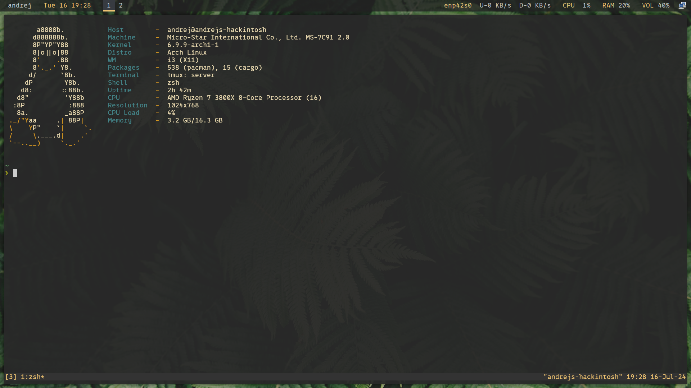

# Dotfiles 

This repository contains all of my dotfiles that I use on my Arch Linux systems.

## Requirements
Before starting, make sure you have the following installed in your system:


### Git

```sh
pacman -S git 
```

### Yay 

```
pacman -S --needed git base-devel && git clone https://aur.archlinux.org/yay.git && cd yay && makepkg -si
```

### Stow 

```sh
pacman -S stow 
```

### Extras

```sh
pacman -S qt5ct lxappearance-gtk3 xfce4-power-manager dunst picom polybar rofi feh redshift pulseaudio blueman gnome-screenshot
```

```sh
yay -S qt5-styleplugins nm-applet
```

## Preview


